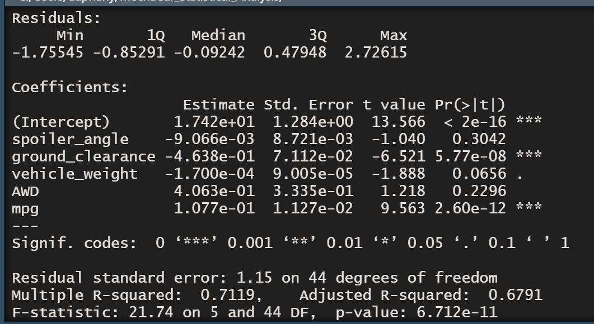
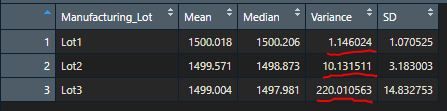
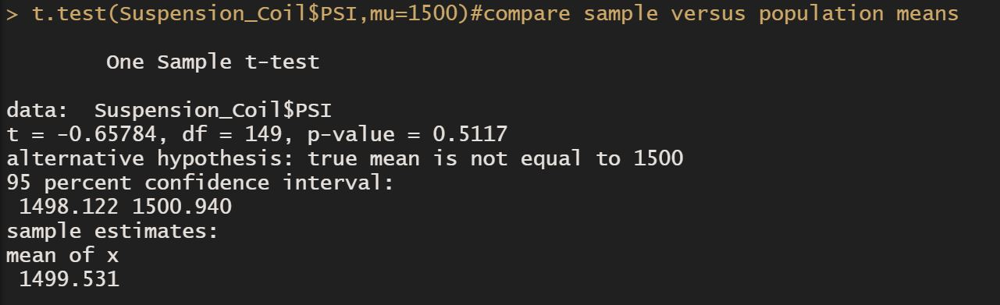
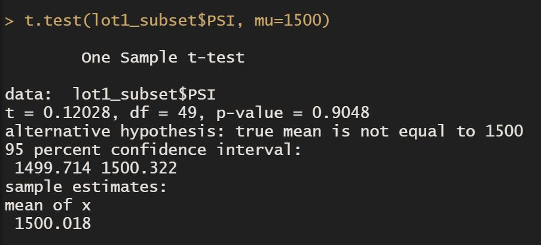
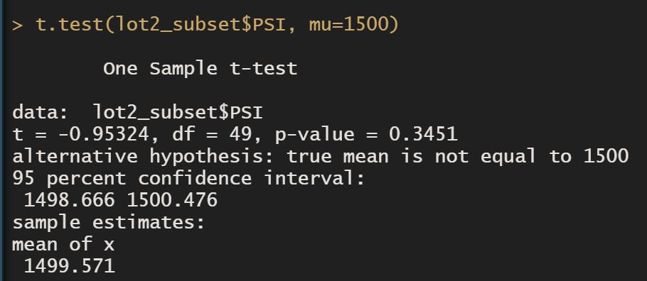
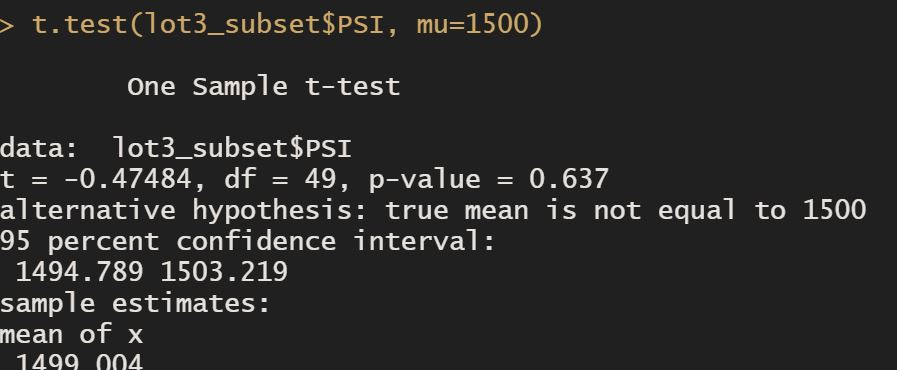

# MechaCar Statistical Analysis
## Linear Regression to Predict MPG
* Which variables/coefficients provided a non-random amount of variance to the mpg values in the dataset? \n
Pr(>|t|)
* Is the slope of the linear model considered to be zero? Why or why not?
H0 : The slope of the linear model is zero, or m = 0
Since p-value of our linear regression analysis is 6.712 X 10^-11 which is much smaller than our assumed significance level of 0.05%, there is sufficient evidence to reject our null hypothesis, which means that the slope of our linear model is not zero.
* Does this linear model predict mpg of MechaCar prototypes effectively? Why or why not?
Yes since p-value is way less than 0.05, it means this data is not inaccurate.
In addition, since the R-sqaured is 0.7119 which means there is 71% of chance that our predict is correct.

## Summary Statistics on Suspension Coils
* The design specifications for the MechaCar suspension coils dictate that the variance of the suspension coils must not exceed 100 pounds per square inch. Does the current manufacturing data meet this design specification for all manufacturing lots in total and each lot individually? Why or why not?
Lot 1 and 2 meet the design specification since the variance is less than 100 while Lot 3 doesn't meet the design specification since its variance is as higher than 100 

## T-Tests on Suspension Coils
 * Since the p-value(0.5117) for the manufacturing lots in total is above our assumed signinficance level of 0.05, we can state that there is not enough evidence to reject the null hypothesis. Thus we say that the PSI across all manufacturing lots are not statistically different from the population mean of 1,500 pounds per square inch.
 *Since the p-value for manufacturing lot1, lot2 and lot3 (0.9048, 0.3451, 0.637) are all above our assumed significance level of 0.05, we can not reject the null hypothesis therefore we state that the PSI across all manufacturing lots is not statistically different from the population mean of 1,500 pounds per square inch.

## Study Design: MechaCar vs Competition
*In this study, we are going to test the metrics of cost for MechaCar and compre it with its competitor. The following hypothesis will be tested:
H0: There is no statistical difference between MechaCar and its competitor.
H1: There is a statistical difference between MechaCar and its competitor.
Since we are comparing the distribution mean from two samples, we will use Two-Sample t-Test. It will allow us to observe if there is difference in terms of cost between MechaCar and its competitor. We will then determine if their relationship is negative or positive and if there is a benefit to do further analysis.
For example, first, we will specify the model of car from MechaCar we would like to test and then identify the similar model from its competitor. Next we will collect the data on cost of the 2 models and calculate the mean. After that we will perform a Two-Sample t-Test on the mean of both car model. If it is found that there is a statistical difference between MechaCar and its competitor, and its negative; we can then dig down to which components of the car caused the difference and see if we we lower the cost of that component in order to lower the overall cost to make our product more cost competitive.
